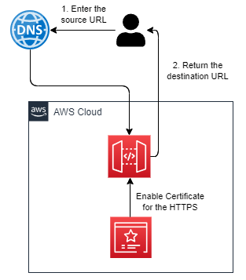

# Serverless Redirect URL

This project is aim to deploy a serverless solution to redirect an URL source to another URL destination by keeping the
the source path.

This solution use only [Amazon API Gateway](https://aws.amazon.com/fr/api-gateway/) for the redirection
and [AWS Certificate Manager](https://aws.amazon.com/fr/certificate-manager/) for the HTTPS of the URL source.

## Prerequisites

You need to be a owner of domain names (source(s) and destination).

### Setting up the public certificate for your URL source

Our Terraform does not create the certificate in ACM (AWS Certificate Manager) (because it depends on where your domain name is located).
> In our case, we assume that you do not have a Hosted Zone in [Amazon Route 53](https://aws.amazon.com/fr/route53/).

**This action must be done for EACH URL sources and NOT for the URL destination.**

**TO DO**: [Create the public certificate in ACM](https://docs.aws.amazon.com/acm/latest/userguide/gs-acm-request-public.html)

## Solution architecture



The Terraform deploys:
- An **Amazon API Gateway**: It is used as a redirect URL. To do a proper redirection, it needs a certificate from ACM.

## How is it working ?

Before starting, you need to check if:
- You have created `the public certificate in ACM`

If so, you can now be able to deploy your infrastructure.

### Deployment of the solution

To deploy this solution, you should do it in 2 steps:
1. The deployment of the infrastructure with **Terraform**. This step is automated by **Terraform**.
2. The configuration of your DNS zone based on the `terraform output`. This step is manual.

#### Step 1: Deploy the infrastructure

Add a `terraform.tfvars` file with the following variables and values:
- `destination_url` : is the URL destination to return. **This should be an URL (e.g. https://mehdilaruelle.com)**.
- `source_domain_names` : is a list of source domain name to transform into the URL destination. **This should be a domain name (e.g. blog.mehdilaruelle.ninja)**.

> Also, create `backend.tf` file with your own Terraform backend configuration if needed.

Once the GIT repository is ready, run your commands (check your AWS credentials beforehand):
```bash
$ terraform init
$ terraform plan
$ terraform apply
```

#### Step 2: Configure your DNS zone

Now, the solution is deployed and you need to configure your DNS zone to "point to the Amazon API Gateway domain name".
For that, you need create a `CNAME` record to your DNS zone from your **domain name source** with the **value of
the Amazon API Gateway**.

To **find the value**, you need to do the following command: `terraform output domain_name`.
The output represent a map with the **domain name source** and the **value of the Amazon API Gateway**.

For example, in my case, we have the following output:
```bash
domain_name = {
  "blog.mehdilaruelle.ninja" = "d-f17x6w9fd4.execute-api.eu-west-3.amazonaws.com"
}
```

I need to create a `CNAME` record in the DNS zone `blog.mehdilaruelle.ninja` with the following value `d-f17x6w9fd4.execute-api.eu-west-3.amazonaws.com`.

When the job is done, you can test the URL redirection. For example, in my case, the `https://blog.mehdilaruelle.ninja` will redirect to `https://mehdilaruelle.com`.

### Cleanup

To destroy this project use the following command:
```bash
$ terraform destroy
```

After that, don't forget to remove:
- The `certificate` on [AWS Certificate Manager](https://aws.amazon.com/fr/certificate-manager/)

<!-- BEGINNING OF PRE-COMMIT-TERRAFORM DOCS HOOK -->
## Requirements

| Name | Version |
|------|---------|
| <a name="requirement_aws"></a> [aws](#requirement\_aws) | ~>5.0 |

## Providers

| Name | Version |
|------|---------|
| <a name="provider_aws"></a> [aws](#provider\_aws) | 5.7.0 |

## Modules

No modules.

## Resources

| Name | Type |
|------|------|
| [aws_api_gateway_base_path_mapping.test](https://registry.terraform.io/providers/hashicorp/aws/latest/docs/resources/api_gateway_base_path_mapping) | resource |
| [aws_api_gateway_deployment.prod](https://registry.terraform.io/providers/hashicorp/aws/latest/docs/resources/api_gateway_deployment) | resource |
| [aws_api_gateway_domain_name.custom](https://registry.terraform.io/providers/hashicorp/aws/latest/docs/resources/api_gateway_domain_name) | resource |
| [aws_api_gateway_integration.proxy](https://registry.terraform.io/providers/hashicorp/aws/latest/docs/resources/api_gateway_integration) | resource |
| [aws_api_gateway_integration.url_redirect](https://registry.terraform.io/providers/hashicorp/aws/latest/docs/resources/api_gateway_integration) | resource |
| [aws_api_gateway_integration_response.proxy](https://registry.terraform.io/providers/hashicorp/aws/latest/docs/resources/api_gateway_integration_response) | resource |
| [aws_api_gateway_integration_response.url_redirect](https://registry.terraform.io/providers/hashicorp/aws/latest/docs/resources/api_gateway_integration_response) | resource |
| [aws_api_gateway_method.proxy](https://registry.terraform.io/providers/hashicorp/aws/latest/docs/resources/api_gateway_method) | resource |
| [aws_api_gateway_method.url_redirect](https://registry.terraform.io/providers/hashicorp/aws/latest/docs/resources/api_gateway_method) | resource |
| [aws_api_gateway_method_response.proxy](https://registry.terraform.io/providers/hashicorp/aws/latest/docs/resources/api_gateway_method_response) | resource |
| [aws_api_gateway_method_response.url_redirect_response](https://registry.terraform.io/providers/hashicorp/aws/latest/docs/resources/api_gateway_method_response) | resource |
| [aws_api_gateway_resource.proxy](https://registry.terraform.io/providers/hashicorp/aws/latest/docs/resources/api_gateway_resource) | resource |
| [aws_api_gateway_rest_api.shortener](https://registry.terraform.io/providers/hashicorp/aws/latest/docs/resources/api_gateway_rest_api) | resource |
| [aws_acm_certificate.source](https://registry.terraform.io/providers/hashicorp/aws/latest/docs/data-sources/acm_certificate) | data source |

## Inputs

| Name | Description | Type | Default | Required |
|------|-------------|------|---------|:--------:|
| <a name="input_destination_url"></a> [destination\_url](#input\_destination\_url) | The URL destination for the redirection. This should be an URL (e.g. https://mehdilaruelle.com). | `any` | n/a | yes |
| <a name="input_region"></a> [region](#input\_region) | AWS region used by the provider | `string` | `"eu-west-3"` | no |
| <a name="input_source_domain_names"></a> [source\_domain\_names](#input\_source\_domain\_names) | The list of domain names source to rewrite as a destination\_domain\_name. This should be a domain name (e.g. blog.mehdilaruelle.ninja). | `list(string)` | n/a | yes |

## Outputs

| Name | Description |
|------|-------------|
| <a name="output_domain_name"></a> [domain\_name](#output\_domain\_name) | This domain name should be add as a CNAME on your DNS zone. |
<!-- END OF PRE-COMMIT-TERRAFORM DOCS HOOK -->

## Contact

You see something wrong ? You want extra information or more ?

Contact me: 3exr269ch@mozmail.com
